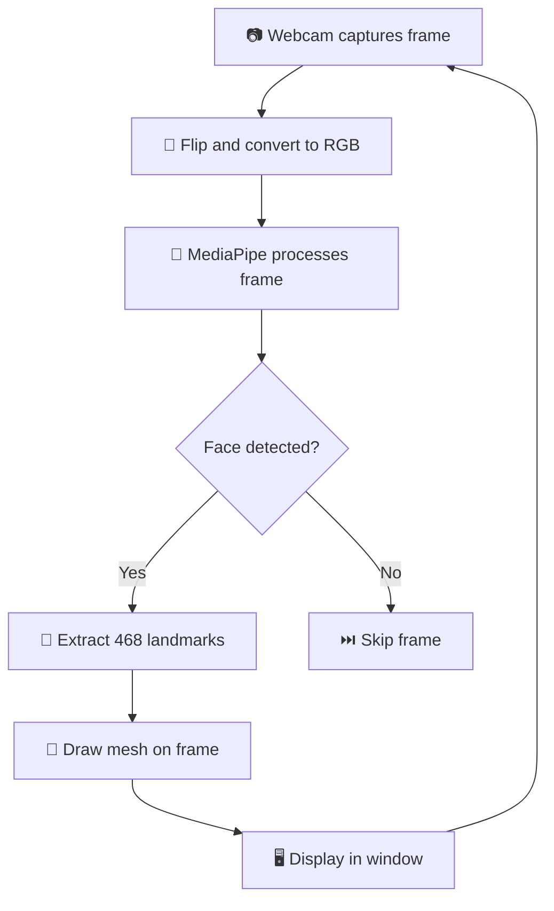

<div align="center">

<!-- Animated Title -->


<br/>

<!-- Badges -->


<br/>

<!-- Animated divider -->


</div>
</div>

<div align="center">


## 🌟 What is Face Mesh?

<div align="center">
</div>

---

<div align="center">

</div>

## ✨ Features

<div align="center">

| Feature | Description |
|---------|-------------|
| 🟢 468 Landmarks | Full 3D facial landmark detection |
| 📷 Real-time | Live webcam feed processing |
| ⚡ CPU Only | No GPU required |
| 🖥️ Cross Platform | Windows, Mac, Linux |
| 📦 Auto Download | AI model downloads on first run |
| 🎯 High Accuracy | MediaPipe Tasks API |

</div>

<div align="center">

</div>

---

<div align="center">

</div>

## ⚙️ Installation

### 1️⃣ Clone the repo
```bash
git clone https://github.com/Abithrekchneanbu/face-mesh.git
cd face-mesh
```

### 2️⃣ Create virtual environment
```bash
# Windows
python -m venv venv
venv\Scripts\activate

# Mac / Linux
python3 -m venv venv
source venv/bin/activate
```

### 3️⃣ Install dependencies
```bash
pip install -r requirements.txt
```

### 4️⃣ Run the project 🚀
```bash
python face.py
```

> 💡 Model file `face_landmarker.task` (~1MB) downloads automatically on first run!

<div align="center">

</div>

---

<div align="center">

</div>

## 🚀 How It Works



<div align="center">

</div>

---

<div align="center">

</div>

## 🛠️ Tech Stack

<div align="center">

| Tool | Version | Purpose |
|------|---------|---------|
| 🐍 Python | 3.11 | Core language |
| 🤖 MediaPipe | 0.10.35 | AI face landmark model |
| 👁️ OpenCV | 4.13 | Webcam and drawing |
| 🔢 NumPy | Latest | Array processing |

</div>

<div align="center">

</div>

---

<div align="center">

</div>

## 📁 Project Structure

---


