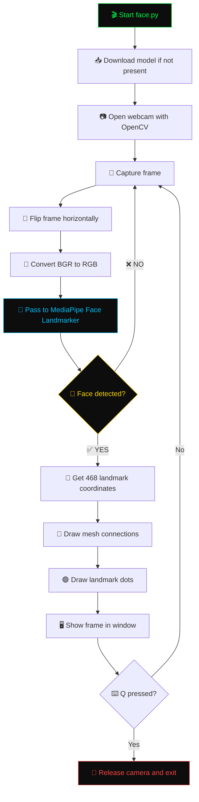

<div align="center">


<br/>


<br/><br/>


<br/>


</div>

---

## 👋 Hey, I'm Abithrekchneanbu!

I'm a developer who loves building cool computer vision projects. This is one of my favorite builds — a **real-time face mesh detector** that maps **468 points** on your face live from your webcam. No fancy hardware needed, just Python and a camera!

I built this because I wanted to understand how modern facial AR filters work under the hood — the kind you see in Snapchat, Instagram, and TikTok. Turns out, it's all about these 468 landmark points!

> *"The best way to learn computer vision is to build something you can literally see working in real time."*

<div align="center">

</div>

---

<div align="center">

</div>

<br/>

<table>
<tr>
<td width="55%">

### 🧠 The Idea

When you open this project and point your webcam at your face, the AI instantly starts mapping **468 unique points** across your entire face — your eyes, nose, lips, cheeks, forehead, and jaw. All in real-time!

These 468 points form a **triangular mesh** (like a 3D net) draped over your face. Every single frame, the model re-detects and re-draws all of them — at smooth speed, on just your CPU.

### 🎯 Why 468 Points?

Google's MediaPipe team trained a neural network on millions of faces to identify exactly these 468 key positions. Each point corresponds to a specific facial feature. For example:
- Points `33` and `263` are your eye corners
- Points `61` and `291` are your lip corners  
- Point `4` is the tip of your nose
- Points `10` and `152` are top and bottom of your face

</td>
<td width="45%">
</td>
</tr>
</table>

<div align="center">

</div>

---

<div align="center">

</div>

<br/>

<div align="center">

|  | Feature | What It Means |
|--|---------|--------------|
| 🟢 | **468 Facial Landmarks** | Every frame, 468 points are detected and drawn on your face |
| 📷 | **Real-time Webcam** | Live video feed processed frame by frame |
| ⚡ | **CPU Only** | No GPU needed — runs on any modern laptop |
| 🖥️ | **Cross Platform** | Works on Windows, Mac, and Linux |
| 📦 | **Auto Model Download** | AI model (~1MB) downloads itself on first run |
| 🎯 | **MediaPipe Tasks API** | Uses Google's latest and most accurate API |
| 🔒 | **100% Local** | Nothing sent to internet — everything runs on your machine |
| 🎨 | **Visual Mesh** | Green dots + connecting lines drawn over your face |
| 🔄 | **Auto Flip** | Webcam is mirrored so it feels natural like a selfie |
| 🛡️ | **Error Handling** | Dropped frames are skipped gracefully, no crashes |

</div>

<div align="center">

</div>

---

<div align="center">

</div>

<br/>

> ✅ **Requirement:** Python 3.11 only. MediaPipe does NOT work on Python 3.12 or above.

### 1️⃣ Clone the repository

```bash
git clone https://github.com/Abithrekchneanbu/face-mesh.git
cd face-mesh
```

### 2️⃣ Create a virtual environment

This keeps your project dependencies separate and clean.

```bash
# Windows
python -m venv venv
venv\Scripts\activate

# Mac / Linux
python3 -m venv venv
source venv/bin/activate
```

You should see `(venv)` appear at the start of your terminal line. That means you're inside the virtual environment.

### 3️⃣ Install all dependencies

```bash
pip install -r requirements.txt
```

This installs MediaPipe, OpenCV, and NumPy automatically.

### 4️⃣ Run it!

```bash
python face.py
```

A window will open showing your webcam. Point it at your face and watch the green mesh appear! Press `Q` to quit.

> 💡 **First run only:** The model file `face_landmarker.task` (~1MB) will download automatically. This only happens once!

<div align="center">

</div>

---

<div align="center">

</div>

<br/>



<br/>

### 🧪 The AI Pipeline Explained

The magic happens in just a few steps:

**Step 1 — Face Detection**
MediaPipe first runs a fast face detector on the full image to find where your face is. This is the same BlazeFace model used in Google products.

**Step 2 — Landmark Prediction**
Once your face is located, a second neural network zooms into that region and predicts the exact 3D coordinates of all 468 points.

**Step 3 — Tracking**
Instead of running the detector every frame (slow), MediaPipe tracks your face from the previous frame and only re-detects when it loses track. This is what makes it real-time fast!

**Step 4 — Drawing**
OpenCV takes those 468 coordinate pairs and draws green circles at each point, then connects them with lines to form the visible mesh.

<div align="center">

</div>

---

<div align="center">

</div>

<br/>

<div align="center">

</div>

<br/>

<div align="center">

| Tool | Version | Why I Used It |
|------|---------|--------------|
| 🐍 **Python** | 3.11 | Best compatibility with MediaPipe |
| 🤖 **MediaPipe** | 0.10.35 | Google's AI model for face landmark detection |
| 👁️ **OpenCV** | 4.13 | Industry standard for webcam and image processing |
| 🔢 **NumPy** | Latest | Fast array operations for image data |
| 💻 **VS Code** | Latest | My code editor of choice |

</div>

<div align="center">

</div>

---

<div align="center">

</div>

<br/>
> 📌 Note: `face_landmarker.task` is auto-downloaded at runtime and excluded from the repo via `.gitignore` to keep the repo lightweight.

<div align="center">

</div>

---

<div align="center">

</div>

<br/>

<div align="center">

| Key | Action |
|:---:|--------|
| `Q` | ❌ Quit and close the window |

</div>

> 💡 Just press `Q` while the webcam window is focused to exit cleanly.

<div align="center">

</div>

---

<div align="center">

</div>

<br/>

This project is a **foundation** — once you have 468 landmark points, you can build almost anything:

<div align="center">

| Project Idea | What You Need |
|-------------|--------------|
| 😴 **Drowsiness Detector** | Track eye landmarks — detect if eyes are closing |
| 💄 **Virtual Makeup** | Overlay colors on lip/cheek landmarks |
| 😊 **Emotion Detector** | Analyze mouth/eyebrow positions |
| 🕶️ **AR Glasses Filter** | Place 3D glasses on eye landmarks |
| 🎭 **Face Swap** | Map one face mesh onto another |
| 🖱️ **Head Pose Mouse** | Control mouse by tilting your head |
| 🎤 **Lip Sync Detector** | Detect when mouth is open/closed |
| 🏋️ **Face Exercise App** | Count facial exercises using landmark movement |

</div>

<div align="center">

</div>

---

<div align="center">

</div>

<br/>

<details>
<summary>📷 &nbsp;<b>Camera not found / No camera error</b></summary>
<br>

On Windows, OpenCV sometimes can't access the camera by default. Use the Windows Media Foundation backend:

```python
# In face.py, change this line:
cap = cv2.VideoCapture(0, cv2.CAP_MSMF)
```

If camera index 0 doesn't work, try index 1:
```python
cap = cv2.VideoCapture(1, cv2.CAP_MSMF)
```
</details>

<details>
<summary>❌ &nbsp;<b>AttributeError: module 'mediapipe' has no attribute 'solutions'</b></summary>
<br>

This happens because newer MediaPipe removed the old `solutions` API. This project uses the new **Tasks API**. Make sure you have the right version:

```bash
pip uninstall mediapipe -y
pip install mediapipe==0.10.35
```
</details>

<details>
<summary>🔒 &nbsp;<b>Camera access denied / permission error</b></summary>
<br>

Windows blocks camera access by default for desktop apps. Fix it here:
Windows Settings

→ Privacy & Security

→ Camera

→ ✅ Camera access → ON

→ ✅ Let apps access your camera → ON

→ ✅ Let desktop apps access your camera → ON


<summary>🐌 &nbsp;<b>Laggy or very low FPS</b></summary>
<br>

Lower the webcam resolution in `face.py`:
```python
cap.set(3, 640)   # width
cap.set(4, 480)   # height
```
Also make sure no other app (Zoom, Teams, OBS) is using your camera at the same time.
</details>

<details>
<summary>⬇️ &nbsp;<b>Model download is very slow or fails</b></summary>
<br>

The model file `face_landmarker.task` is only ~1MB and downloads once. If it fails, you can manually download it from:
https://storage.googleapis.com/mediapipe-models/face_landmarker/face_landmarker/float16/1/face_landmarker.task

Place it in the same folder as `face.py` and it won't try to download again.
</details>

<details>
<summary>🪟 &nbsp;<b>Window opens but shows black screen</b></summary>
<br>

Your camera might need a moment to warm up. Wait 2-3 seconds. If still black, try changing the backend:
```python
cap = cv2.VideoCapture(0, cv2.CAP_DSHOW)
```
</details>

<div align="center">

</div>

---

<div align="center">

</div>

<br/>

Contributions are welcome! If you want to improve this project:

1. 🍴 **Fork** this repo
2. 🌿 **Create** a new branch: `git checkout -b feature/your-feature`
3. ✏️ **Make** your changes
4. 💾 **Commit:** `git commit -m "Add your feature"`
5. 📤 **Push:** `git push origin feature/your-feature`
6. 🔃 **Open** a Pull Request

### 💡 Ideas for contribution
- Add FPS counter on screen
- Add multiple face detection support
- Add face landmark index labels
- Add face distance estimation
- Add screenshot save feature with `S` key

<div align="center">

</div>

---

<div align="center">

</div>

<br/>

This project is licensed under the **MIT License** — feel free to use it, modify it, and build on top of it. Just give credit! 🙏

<div align="center">

</div>

---

<div align="center">


<br/><br/>

[](https://github.com/Abithrekchneanbu/face-mesh/stargazers)
[](https://github.com/Abithrekchneanbu/face-mesh/network)
[](https://github.com/Abithrekchneanbu/face-mesh)
[](https://github.com/Abithrekchneanbu)

<br/>


</div>
